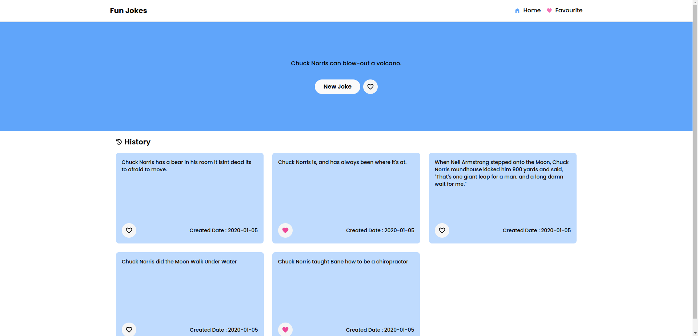

## Random Jokes Ineuron Internship Project

---

This is a simple random jokes appthat displays a random joke everytime user clicks on fetch a new joke button.

</br>

</br>

### 🖥️ ScreenShot :

</br>



</br>

### 👩‍💻 Tech Stack :

</br>

- React Js
- Tailwind CSS

</br>

#### Dependencies :

</br>

```javascript

  "dependencies": {
    "axios": "^1.4.0",
    "framer-motion": "^10.12.9",
    "react": "^18.2.0",
    "react-dom": "^18.2.0",
    "react-hot-toast": "^2.4.1",
    "react-icons": "^4.8.0",
    "react-router-dom": "^6.11.1"
  },

```

</br>

### 📁 File Strutcture :

</br>

```

|   .gitignore
|   index.html
|   package-lock.json
|   package.json
|   postcss.config.js
|   README.md
|   screenshot.png
|   tailwind.config.js
|   vite.config.js
|
+---public
|       favicon.svg
|
|
\---src
    |   App.jsx
    |   index.css
    |   main.jsx
    |
    +---Components
    |       Favourite.jsx
    |       Header.jsx
    |       History.jsx
    |       Item.jsx
    |       Mainbody.jsx
    |
    \---Context
            ContextApi.jsx

```
